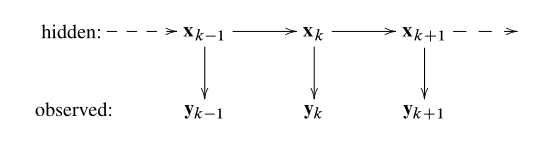
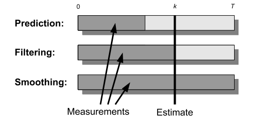

# 贝叶斯推理的最优滤波和平滑

在数学术语中，最优滤波和平滑被认为是统计反演问题，其中未知量是通过一系列的噪声观测$\{y_1,y_2,\cdots\}$得到的时间序列向量$\{x_0,x_1,x_2,\cdots\}$。如下图所示。

> 在最优滤波和平滑问题中，隐藏状态序列$x_k$是通过噪声测量$y_k$间接得到的。

统计反演的目的是从观测到的测量值$y_{1:T} = \{y_1,\cdots,y_T\}$估计隐藏状态$x_{0:T}=\{x_0,\cdots,x_T\}$，这意味着在贝叶斯的角度下，我们想要计算给定所有测量值的所有状态的联合后验分布。原则上，这可以通过直接应用贝叶斯规则来实现：
$$
p(x_{0:T}|y_{1:T}) = \frac{p(y_{1:T}|x_{0:T})p(x_{0:T})}{p(y_{1:T})}
$$
其中

+ $p(x_{0:T})$是由动态模型定义的先验分布

+ $p(y_{1:T}|x_{0:T})$是测量的似然模型

+ $p(y_{1:T})$为归一化参数，定义为
  $$
  p(y_{1:T}) = \int p(y_{1:T}|x_{0:T})p(x_{0:T}) dx_{0:T}
  $$

不幸的是，上述完全后验估计有一个很大的缺点，即我们每次新引入一个观测，我们都需要新计算后验估计，这使得计算的代价增大。因此，我们需要对序列进行一些假设：

+ 初始分布指定在初始步长$k=0$处隐藏状态$x_0$的先验分布$p(x_0)$
+ 动态模型将系统动态及其不确定性描述为马尔可夫序列，定义为转移概率$p(x_k|x_{k-1})$
+ 测量模型描述测量$y_k$如何依赖于当前状态$x_k$。通过给定状态下测量的条件概率来对依赖性进行建模，符号表示为$p(y_k|x_k)$。

因此，一般的概率状态空间模型通常以以下形式编写：
$$
\begin{aligned}
x_0 &\sim p(x_0)\\
x_k &\sim p(x_k|x_{k-1})\\
y_k &\sim p(y_k|x_k)
\end{aligned}
$$
由于计算所有时间步长的状态的完全联合分布在计算上非常低效并且在实时应用上是不必要的，因此在贝叶斯滤波和平滑中，取而代之的是考虑如下的边缘分布：

+ 贝叶斯滤波计算的滤波分布是给定当前和先前观测$y_{1:k} = \{y_1,\cdots,y_k\}$的当前状态$x_k$的边缘分布
  $$
  p(x_k|y_{1:k}), \quad k = 1,\cdots,T
  $$

+ 可以用贝叶斯滤波器的预测步长计算的预测分布是当前时间步长之后的未来状态$x_{k+n}$，$n$步长的边缘分布
  $$
  p(x_{k+n}|y_{1:k}), \quad k = 1,\cdots,T,\quad n = 1,2,\cdots
  $$

+ 通过贝叶斯平滑器计算的平滑分布是给定一定的间隔$y_{1:T}=\{y_1,\cdots,y_T\}$的观测$T>k$，状态$x_k$的边缘分布
  $$
  p(x_k|y_{1:T}),\quad k = 1,\cdots,T.
  $$

> 根据测量相对于估计状态时间的时间跨度，状态估计问题可分为最优预测、滤波和平滑。

