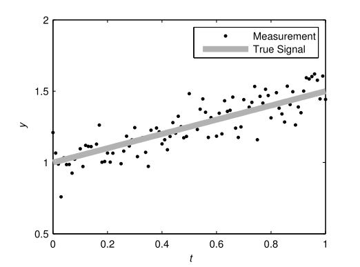

# 批量线性回归

考虑线性模型：
$$
y_k = \theta_1 + \theta_2t_k + \epsilon_k(3.1)
$$
其中我们假设测量误差是零均值且有给定方差的高斯分布，即$\epsilon_k\sim N(0,\sigma^2)$并且参数$\theta=(\theta_1\quad\theta_2)^T$的先验分布是具有已知均值和协方差的**高斯分布**，即$\theta\sim \mathrm{N}(\mathrm{m}_0,\mathrm{P}_0)$。在经典的线性回归问题中我们想要去从一组观测值$\mathcal{D}=\{(t_1,y_1),\cdots,(t_T,y_T)\}$中估计参数$\theta$。仿真中使用的测量数据和真正的线性函数如下图所示：

在概率表示法中，线性回归模型可以写成：
$$
\begin{aligned}
p(y_k|\theta) &= \mathrm{N}(y_k|\mathrm{H}_k\theta,\sigma^2)\\
p(\theta)&= \mathrm{N}(\theta|\mathrm{m}_0,\mathrm{P}_0)(3.2)
\end{aligned}
$$
其中行向量$\mathrm{H}_k=(1\quad t_k)$并且$\mathrm{N}(\cdot)$表示高斯概率密度函数。

方程3.2的线性回归问题的批量解(batch solution)可以直接应用贝叶斯公式得到：
$$
\begin{aligned}
p(\theta|y_{1:T})&\propto p(\theta)\prod_{k=1}^Tp(y_k|\theta)\\
&= \mathrm{N}(\theta|\mathrm{m}_0,\mathrm{P}_0)\prod_{k=1}^T\mathrm{N}(y_k|\mathrm{H}_k\theta,\sigma^2)
\end{aligned}
$$
在上面的后验分布中，我们假设了$t_k$和$\mathrm{H}_k$的条件，但是不会明确表示他们。因此后验分布表示为以$y_{1:T}$为条件，而不是以包含回归量$t_k$的数据集$\mathcal{D}$为条件。这样简化的原因是简化的符号同样适用于更一般的滤波问题。

> **高斯分布的乘积也是高斯分布**
>
> 假设有两个分布：
> $$
> p_1(x) = \frac{1}{\sqrt{2\pi}\sigma_1}\exp^{-\frac{(x-\mu_1)^2}{2\sigma_1^2}}\\
> p_2(x) = \frac{1}{\sqrt{2\pi}\sigma_2}\exp^{-\frac{(x-\mu_2)^2}{2\sigma_2^2}}
> $$
> 高斯分布相乘
>
> 计算这两个高斯分布的乘积
> $$
> p_1(x)p_2(x) = \frac{1}{2\pi\sigma_1\sigma_2}\exp^{-\left(\frac{(x-\mu_1)^2}{2\sigma_1^2}+\frac{(x-\mu_2)^2}{2\sigma_2^2}\right)}
> $$
> 高斯分布的乘积还是高斯分布，可以得到其均值和方差
> $$
> \mu = \frac{\mu_1\sigma_2^2+\mu_2\sigma_1^2}{\sigma_1^2+\sigma_2^2}\\
> \frac{1}{\sigma^2}= \frac{1}{\sigma_1^2}+\frac{1}{\sigma_2^2}\\
> \sigma^2 = \frac{\sigma_1^2\sigma_2^2}{\sigma_1^2+\sigma_2^2}
> $$
> 相乘后的均值$\mu$位于$\mu_1$和$\mu_2$之间，方差小于$\sigma_1^2$和$\sigma_2^2$。

因为先验和似然都是高斯分布，后验分布也是高斯分布
$$
p(\theta|y_{1:T}) = \mathrm{N}(\theta, \mathrm{m}_T,\mathrm{P}_T)
$$
平均值和协方差可以通过在指数中填写二次型来获得，即：
$$
\begin{aligned}
\mathrm{m}_T &= \left[\mathrm{P}_0^{-1}+\frac{1}{\sigma^2}\mathrm{H^T H}\right]^{-1}\left[\frac{1}{\sigma^2}\mathrm{H^T y}+\mathrm{P}_0^{-1}\mathrm{m}_0\right]\\
\mathrm{P}_T &= \left[\mathrm{P}_0^{-1}+\frac{1}{\sigma^2}\mathrm{H^T H}\right]^{-1}
\end{aligned}
$$
其中$\mathrm{H}_k = (1\quad t_k)$并且
$$
\mathbf{H}=\left(\begin{array}{c}\mathbf{H}_{1} \\ \vdots \\ \mathbf{H}_{T}\end{array}\right)=\left(\begin{array}{cc}1 & t_{1} \\ \vdots & \vdots \\ 1 & t_{T}\end{array}\right), \quad \mathbf{y}=\left(\begin{array}{c}y_{1} \\ \vdots \\ y_{T}\end{array}\right)
$$

> 要证明此公式，我们首先需要推出多元高斯分布函数的概率密度的乘积：
>
> 我们所熟知的多元高斯分布形式如下：
> $$
> \frac{1}{2\pi^{\frac{D}{2}}|\Sigma|^{\frac{1}{2}}}\exp^{-\frac{1}{2}(x-\mu)^T\Sigma^{-1}(x-\mu)}
> $$
> 多元高斯分布的另一种自然分布形式用到的参数为：
> $$
> \begin{aligned}
> \Lambda &= \Sigma^{-1}\\
> \xi &= \Sigma^{-1}\mu
> \end{aligned}
> $$
> 
>
> 分布形式如下：
> $$
> \frac{1}{2\pi^{\frac{D}{2}}}|\Lambda|^{\frac{1}{2}}\exp^{-\frac{1}{2}(x^T\Lambda x-2x^T\xi + \xi \Lambda^{-1}\xi)}
> $$
> 将指数外的系数放入指数部分，得到：
> $$
> \exp^{-\frac{1}{2}x^T\Lambda x+\xi^Tx-\zeta}
> $$
> 其中$\zeta$为：
> $$
> \frac{1}{2}(\xi^T\Lambda^{-1}\xi + D\ln2\pi-\ln|\Lambda|)
> $$
> 在多个高斯分布相乘时，得到的结果如下：
> $$
> \exp^{-\frac{1}{2}x^T(\sum_i^n\Lambda_i)x+(\sum_i^n\xi_i)^Tx-\sum_i^n\zeta_i}
> $$
> 结果仍为高斯分布。
>
> 有公式
> $$
> \begin{aligned}
> p(\theta|y_{1:T})&\propto p(\theta)\prod_{k=1}^Tp(y_k|\theta)\\
> &= \mathrm{N}(\theta|\mathrm{m}_0,\mathrm{P}_0)\prod_{k=1}^T\mathrm{N}(y_k|\mathrm{H}_k\theta,\sigma^2)
> \end{aligned}
> $$
> 我们可以求得$\theta$的后验分布，通过似然函数我们可以通过最小二乘法得到$\theta$的的均值为$(H^TH)^{-1}H^TY$，其方差根据协方差的性质可得为：$(H^TH)^{-1}H^T[(H^TH)^{-1}H^T]^T\sigma^2 = \sigma^2(H^TH)^{-1}$。
>
> 而先验分布的均值为$m_0$，协方差为$P_0$。所以根据多元高斯分布乘积的均值和协方差公式得乘积后得方差为
> $$
> \Sigma = (\sum_i^n\Sigma_i^{-1})^{-1} = [P_0^{-1}+\frac{1}{\sigma^2}(H^TH)]^{-1}\\
> \mu = (\sum_i^n\Sigma_i^{-1})^{-1}\left[\sum_i^n(\Sigma_i^{-1}\mu_i)\right] = [P_0^{-1}+\frac{1}{\sigma^2}(H^TH)]^{-1}\cdot[P_0^{-1}m_0+\frac{1}{\sigma^2}H^Ty]
> $$
> 

